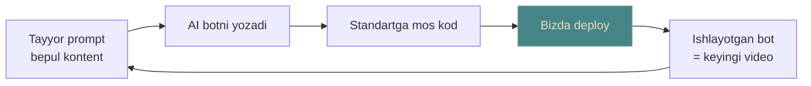
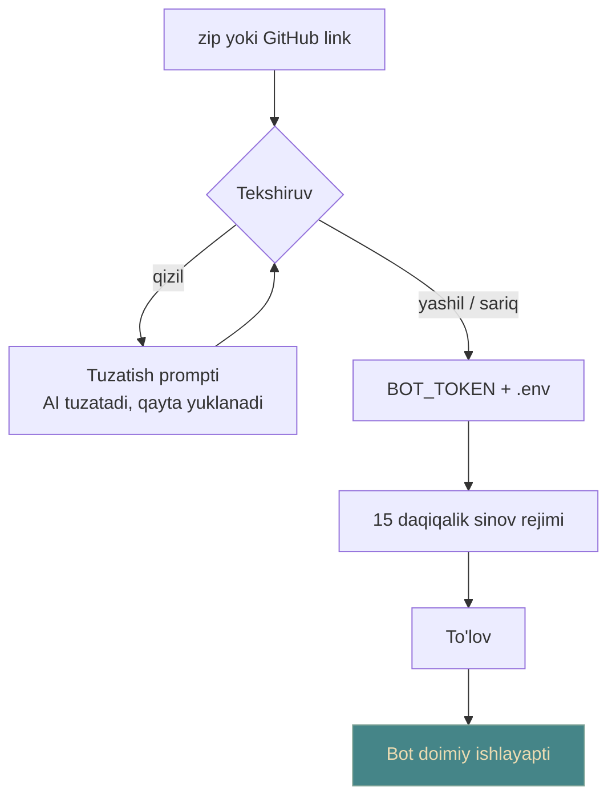
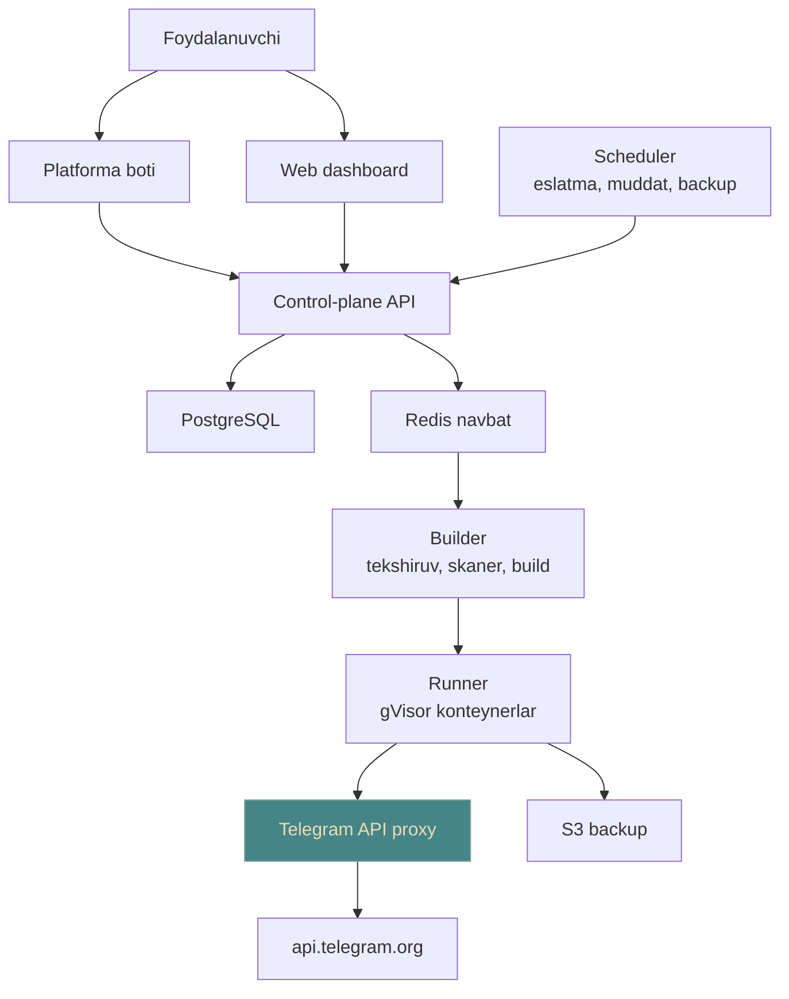
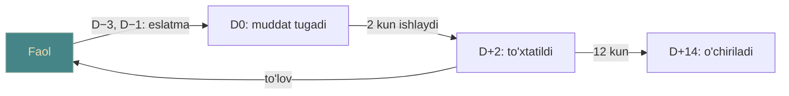
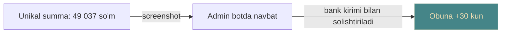

**Status: designing.** Kod yo'q, reja bor. Ishchi nom — BotHost UZ.

Bot yozish bir kunlik ishga aylandi. Uni ishlab turishga qo'yish esa hali ham VPS,
Linux, Docker va chet el kartasini talab qiladi. Odam botini yozdi, kompyuterida
ishga tushirdi — kompyuter o'chdi, bot ham o'chdi. Ko'pchilik shu yerda to'xtaydi.

BotHost — aynan o'sha oxirgi bosqich. Zip yoki GitHub link tashlanadi, platforma
tekshiradi, konteynerda ishlatadi, kuniga backup qiladi, analitika ko'rsatadi.
To'lov so'mda, boshqaruv Telegram ichida.

Va'da bitta jumla: **Botingni tashla — biz ishlatamiz, saqlaymiz va o'sishini
ko'rsatamiz.**

## Nega aynan biz

Xorijiy hostinglar bor va ular yomon emas. Ularda yo'q narsa uchta: so'mda to'lov,
o'zbek tilida onboarding va tayyor promptlar kutubxonasi. Uchinchisi eng qizig'i —
u bir vaqtda ham marketing, ham mahsulot.



Prompt tarqaladi, undan chiqqan kod bizning standartga birinchi urinishda mos
keladi, natija esa keyingi videoning o'zi bo'ladi.

## Kim to'laydi

| Segment | Og'riq | Nima to'laydi |
|---|---|---|
| **AI-builderlar** | Botni yozdi, deploy qila olmaydi | Eng oddiy tarif, 1 bot |
| **Kanal egalari, SMM** | Konkurs, obuna tekshirish, analitika kerak | Shablon + hosting |
| **Kichik biznes** | Buyurtma va navbat boti, ishonchlilik | O'rta tarif, backup |
| **Frilanserlar** | Har mijoz uchun server sozlash | Ko'p botli tarif |

Birinchi fokus — AI-builderlar va kanal egalari: eng ko'p va eng tez qaror
qiladiganlar. Frilanserlar eng qimmatli segment, lekin ularni ishontirish uchun
allaqachon ishlab turgan mahsulot kerak.

## Deploy — uch qadam



Birinchi ikki qadam to'lovdan oldin va bepul. Bot sinov rejimida 15 daqiqa
ishlaydi — odam o'z botining haqiqatan ishlashini ko'radi, keyin to'laydi. Bepul
oy yo'q: u abuse'ning asosiy manbai.

## Bot Standarti

Foydalanuvchi kodiga bizning kodimiz qo'shilmaydi. Uning o'rniga olti qoida bor —
AI ularni bitta promptda bajaradi, platforma esa avtomatik tekshiradi.

| # | Qoida | Nega | Qanday tekshiriladi |
|---|---|---|---|
| 1 | Token `BOT_TOKEN` env'dan, kodda token yo'q | Xavfsizlik, tokenni almashtirish | Kodda regex bilan qidiriladi |
| 2 | API manzili `TELEGRAM_API_URL` env'dan | Analitika proxy orqali ishlaydi | Kutubxona sozlamasi statik tahlil |
| 3 | Bog'liqliklar faylda va versiyasi bilan | Takrorlanadigan build | Fayl mavjudligi + build |
| 4 | Kirish nuqtasi ma'lum yoki `bothost.yaml` da | Qanday ishga tushirishni bilish | Fayl yoki manifest |
| 5 | Doimiy ma'lumotlar faqat `DATA_DIR` ichida | Backup va tiklash | Yozish yo'llari tekshiriladi |
| 6 | Hamma sozlama `.env.example` da | Dashboard o'zi so'raydi | Fayl parse qilinadi |

Ixtiyoriy manifest:

```yaml
runtime: python3.12   # yoki node20, go1.22
start: python main.py
memory: 256mb
env:
  - BOT_TOKEN
  - ADMIN_ID
```

Tekshiruv quvuri bir-ikki daqiqa oladi: arxiv hajmi va fayl turlari
(`node_modules`, `venv`, `.git` tashlanadi) → til va kirish nuqtasi → olti qoida →
xavfsizlik skaneri (mayner imzolari, shubhali `os.system` / `child_process`,
ma'lum zararli paketlar, ochiq qolgan tokenlar) → build → 30 soniyalik smoke test,
`getMe` proxy'da ko'rinishi kerak.

Natija uch xil: **yashil**, **sariq** (ogohlantirish bilan o'tadi), **qizil**.
Qizil bo'lsa xatoni tushuntirib o'tirmaymiz — AI'ga tashlash uchun tayyor
"tuzatish prompti" beramiz. Odam xatoni tushunishi shart emas, tuzatilishi kerak.

## Arxitektura



MVP bitta VPS'da yashaydi — 8 vCPU / 32 GB taxminan 150–250 ta kichik botni
ko'taradi, buni yuklama testi bilan tasdiqlash kerak. O'sganda runner serverlar
qo'shiladi, control-plane o'zgarmaydi.

Eng muhim chiziq: **bot kodi API yoki bazani ko'rmaydi.** U faqat o'z konteynerida
va proxy orqali Telegram bilan gaplashadi.

| Komponent | Texnologiya (taklif) |
|---|---|
| Control-plane API | Go (chi) yoki FastAPI |
| Platforma boti, admin boti | aiogram 3 |
| Dashboard va admin panel | Next.js |
| Builder | Nixpacks + BuildKit, Redis navbat |
| Runner | Docker + gVisor |
| Proxy | Go reverse-proxy |
| Ma'lumotlar | PostgreSQL, Redis, MinIO |
| Monitoring | Prometheus, Grafana, Loki |

### Sandbox

Bu loyihaning eng xavfli joyi: begona kod mening serverimda va mening nomimdan
ishlaydi. Shuning uchun har bot — alohida konteyner, gVisor runtime, root emas,
read-only fayl tizimi, faqat `/data` yoziladi. RAM tarifga qarab, 0.25–1 vCPU,
PID ≤ 100, disk kvotasi. Botlar bir-birini ko'rmaydi, ichki tarmoq va 25-port
yopiq. CPU 10 daqiqa 90% dan yuqori tursa — avtomatik to'xtatish va admin'ga
alert. Bu mayner belgisi.

### Analitika — kodga tegmasdan

Bot `TELEGRAM_API_URL` orqali bizning proxy'ga murojaat qiladi, proxy so'rovni
Telegram'ga uzatadi va faqat metadata yozadi: update turi, hash qilingan
foydalanuvchi ID, vaqt, xato kodi, javob tezligi. **Xabar matni saqlanmaydi** — bu
shartlarda ochiq yozilishi kerak. Natijada DAU, yangi foydalanuvchilar, eng ko'p
ishlatilgan buyruqlar va xatolar dashboard'da, kodga bitta qator qo'shmasdan.

Backup har kuni 03:00 (Toshkent): `/data` snapshot, siqiladi, shifrlanadi, S3'ga
ketadi. Saqlash 7 / 14 / 30 kun. Tiklash — sana tanlanadi, bir bosish. Platformaning
o'z bazasi har 6 soatda boshqa provayderga nusxalanadi.

## Obuna sikli



Uchta eslatma — uch kun oldin, bir kun oldin, muddat kunida. Bot muddat tugagan
kuni to'xtamaydi, ikki kun ishlaydi; to'xtaganda ham o'chirilmaydi. Kundalik
backup barcha tariflarda bor, farq faqat saqlash muddatida.

## To'lov



Hiyla — **unikal summa**: tarif narxi + tasodifiy 1–99 so'm, 24 soat band
qilinadi. Admin bank ilovasidagi kirimni summa bo'yicha solishtiradi, soxta
screenshot o'tmaydi. Tasdiqlash admin botda bitta bosish.

Keyin: v1'da Payme yoki Click merchant API bilan avtomatik tasdiqlash (merchant
uchun odatda YaTT yoki MChJ kerak, shartlarni provayderdan aniqlash lozim), v2'da
kartani saqlab oylik avtomatik yechish.

## Tariflar

| Tarif | So'm/oy | RAM / CPU | Backup | Qo'shimcha |
|---|---|---|---|---|
| **Start** | 39 000 | 256 MB / 0.25 | 7 kun | 1 bot, asosiy analitika |
| **Pro** | 79 000 | 512 MB / 0.5 | 14 kun | GitHub avto-deploy, to'liq analitika |
| **Biznes** | 149 000 | 1 GB / 1 | 30 kun | Webhook + o'z domen, ustuvor support |
| **Frilanser** | 149 000 | 5 × Start | 7 kun | 5 bot, botni mijozga topshirish |

Yillik to'lov — 10 oy narxiga 12 oy. Referal: do'st to'lasa ikkalasiga +7 kun.
Narxlar birinchi 30 mijoz bilan sinaladi, keyin qotiriladi.

Arifmetika (farazlar bilan): server va backup ≈ 1,5 mln so'm/oy, o'rtacha to'lov
≈ 60 000 so'm/bot. Zararsizlik nuqtasi — **25 ta to'lovchi bot**. 100 bot ≈ 6 mln
daromad, ≈ 4,5 mln sof, bitta serverda. 200 botda ikkinchi server kerak, marja
70–75% da qoladi. Vaqtim bu hisobda yo'q.

## Admin ishi

Kunlik operatsion yuk 10 daqiqadan oshmasligi kerak, aks holda loyiha side hustle
bo'lib qolmaydi. Shuning uchun admin ikki joyda: web panelda to'liq boshqaruv
(to'lov navbati, botlar, foydalanuvchilar, tekshiruv navbati, shikoyatlar,
tariflar, broadcast, audit log), admin botda esa telefondan tezkor amallar —
to'lovni bitta bosishda tasdiqlash, alertlar, 09:00 dagi kunlik hisobot.

Rollar ikkita: **owner** (hammasi) va **operator** (to'lov, support, botni
to'xtatish — pulga va tariflarga kirmaydi). Har bir admin amali audit logga
yoziladi, web panelga kirish Telegram OTP bilan.

## Xavfsizlik, abuse va huquqiy tomon

Eng katta xavf texnik emas. Begona kod mening serverimda ishlaydi, demak
firibgarlik ham, spam ham menga yozilishi mumkin. Qoidalar birinchi kundan:

- **Foydalanish shartlari:** firibgarlik, fishing, spam, qimor, noqonuniy kontent,
  mayning, DDoS taqiqlanadi. Buzilsa ogohlantirishsiz to'xtatish, pul qaytmaydi.
- **Har bot sahifasida "Shikoyat qilish"** — shikoyat to'g'ridan admin botga.
- **Avtomatik belgilar:** yuqori CPU, ko'p chiquvchi so'rov, Telegram'dan 429/403
  to'lqini, bitta odamda bir kunda 5+ bot.
- **Yangi akkauntning birinchi boti** qo'lda tekshiruv navbatidan o'tadi, bir daqiqa.

Ma'lumotlar: tokenlar va `.env` AES-256 bilan shifrlangan, kalit alohida, admin ham
ochiq ko'rmaydi. Proxy matn saqlamaydi. Backup shifrlangan, yuklab olish linki 24
soat yashaydi.

Huquqiy tomonni maslahatchi bilan tekshirish kerak, lekin uchta narsa allaqachon
ravshan: muntazam biznes to'lovini kartaga olish uchun YaTT maqomi kerak bo'ladi
(merchant uchun baribir talab qilinadi); O'zbekistonda shaxsiy ma'lumotlarni
mahalliy serverlarda saqlash talabi bor — mahalliy data-markaz tanlash bu yerda
majburiyat emas, reklama ustunligi; ommaviy oferta va maxfiylik siyosati saytda ham,
botda ham turishi kerak, to'lov qilish ofertaga rozilik hisoblanadi.

## Go-to-market

Dvigatel — prompt kutubxonasi. Har bir prompt bepul kontent, har bir natija bizda
deploy bo'ladigan bot.

1. **Kontent.** Telegram kanal + Shorts: "AI bilan 10 daqiqada konkurs boti". Har
   video bitta prompt, oxirida "tashlang, ikki daqiqada ishga tushadi".
2. **Hamjamiyat.** O'zbek dasturchi va SMM guruhlari. Birinchi 20 foydalanuvchiga
   bir oy bepul — evaziga fikr va sharh.
3. **Kanal egalari.** "Kim odam qo'shdi" va analitika botlari tayyor shablon
   sifatida, to'g'ridan adminlarga.
4. **Frilanserlar.** Mijozini olib kelsa chegirma yoki referal foiz.
5. **Ishonch.** Ochiq status sahifa, "ma'lumotlaringiz O'zbekistonda", o'zbek
   tilida tezkor javob.

Birinchi 90 kun maqsadi: 300 ro'yxatdan o'tgan, 60 to'lovchi bot.

## Metrikalar va xavflar

| Metrika | Nimani ko'rsatadi | 90 kun |
|---|---|---|
| Upload → yashil tekshiruv | Standart va promptlar ishlayaptimi | ≥ 70% |
| Yashil → to'lov | Mahsulot qiymati | ≥ 35% |
| Oylik churn | Ushlab qolish | ≤ 8% |
| MRR | Daromad | 3,5 mln so'm |
| To'lov tasdiqlash vaqti | Operatsion yuk | ≤ 30 daqiqa |
| Server yuklamasi | Qachon yangi server kerak | < 70% |

| Xavf | Javob |
|---|---|
| Zararli yoki firibgar bot | Sandbox, skaner, tekshiruv navbati, shikoyat, oferta |
| Soxta screenshot | Unikal summa + bank kirimi; keyin merchant API |
| Qo'lda tasdiqlash vaqtni yeydi | Admin botda 1 bosish, 50+ to'lovdan keyin merchant API |
| Bitta server yiqiladi | Backup boshqa provayderda, tiklash yo'riqnomasi, status sahifa |
| Proxy tiqilishi | Bot bo'yicha rate-limit, proxy'ni gorizontal kengaytirish |
| Xorijiy raqobatchilar | Farq: so'm, o'zbek tili, promptlar, Telegram ichida boshqaruv |

## Keyingi qadam

MVP — kechki ish vaqti bilan olti hafta. Birinchi ikki hafta faqat **sandbox va
builder**: eng xavfli texnik qism va bitta Python botni qo'lda deploy qilib ko'rish.
Qolgani shu poydevor ustida quriladi. Keyingi bosqichga darvoza sharti bajarilmasa
o'tilmaydi — birinchi darvoza 100 ta to'lovchi bot, olti oyda.

## Tayyor promptlar

Har bir prompt Bot Standartini o'z ichiga oladi, shuning uchun natija tekshiruvdan
birinchi urinishda o'tadi.

<details>
<summary>0 — Standartlashtirish prompti (mavjud botni moslashtirish)</summary>

```text
Sen tajribali backend dasturchisan. Quyida mening Telegram botimning kodi. Uni
BotHost platformasida ishlashi uchun moslashtir, bot mantig'ini O'ZGARTIRMA.

Qoidalar:
1. Bot token faqat BOT_TOKEN env o'zgaruvchisidan o'qilsin. Kodda token qolmasin.
2. Telegram API manzili TELEGRAM_API_URL env'dan olinsin (default:
   https://api.telegram.org). Kutubxonaning custom API server sozlamasidan
   foydalan (aiogram: TelegramAPIServer.from_base, python-telegram-bot: base_url,
   telegraf/grammY: apiRoot, go-telegram-bot-api: NewBotAPIWithAPIEndpoint).
3. Barcha bog'liqliklar requirements.txt / package.json / go.mod da versiyasi
   bilan bo'lsin.
4. Kirish nuqtasi: main.py, index.js (TS bo'lsa build skripti va dist/index.js)
   yoki main.go.
5. Doimiy ma'lumotlar (SQLite, fayllar) faqat DATA_DIR env papkasida
   (default: ./data) saqlansin.
6. Barcha env o'zgaruvchilar .env.example faylida izoh bilan ro'yxat qilinsin.
7. Xatolar log qilinsin, bot bitta xatodan yiqilmasin; to'xtash signalida
   (SIGTERM) toza yopilsin.

Natija: to'liq fayllar ro'yxati va har bir faylning to'liq kodi. Oxirida nimani
o'zgartirganingni 5 qatorda yoz.

[KODNI SHU YERGA QO'YING]
```

</details>

<details>
<summary>1 — Tadbirga ro'yxatdan o'tish boti</summary>

```text
Python 3.12 va aiogram 3 da Telegram bot yoz: tadbir (forum, meetup, kurs) uchun
ro'yxatdan o'tish.

Funksiyalar:
- /start: tadbir haqida qisqa ma'lumot (nomi, sana, joy, tavsif — hammasi
  config.py da) va "Ro'yxatdan o'tish" tugmasi.
- Ro'yxatdan o'tish FSM: ism-familiya, telefon ("Kontaktni yuborish" tugmasi
  orqali), kompaniya yoki o'qish joyi, qatnashish formati (offline / online).
  Oxirida ma'lumotlarni tasdiqlash ekrani.
- Har bir qatnashchiga unikal raqam va QR-kod (qrcode kutubxonasi) yuboriladi.
- Joylar soni cheklangan (config: MAX_SEATS). To'lsa — kutish ro'yxatiga yoziladi
  va joy bo'shasa avtomatik xabar boradi.
- Qatnashchi o'z ro'yxatini bekor qila oladi.
- Tadbirdan 1 kun va 2 soat oldin avtomatik eslatma (APScheduler).
- Admin (ADMIN_IDS env, vergul bilan) buyruqlari: /stats (jami, offline/online,
  kutish ro'yxati), /export (Excel, openpyxl), /broadcast, /checkin <raqam>.
- Til: o'zbek (lotin).

Texnik talablar (majburiy):
1. Token BOT_TOKEN env'dan; kodda token yo'q.
2. Telegram API manzili TELEGRAM_API_URL env'dan (default
   https://api.telegram.org), aiogram TelegramAPIServer.from_base orqali.
3. SQLite (aiosqlite) baza DATA_DIR env papkasida (default ./data).
4. requirements.txt versiyalar bilan, kirish nuqtasi main.py.
5. .env.example: BOT_TOKEN, ADMIN_IDS, TELEGRAM_API_URL, DATA_DIR.
6. Long polling; SIGTERM'da toza to'xtash; xatolar log qilinadi.

Natija: loyiha tuzilmasi va har bir faylning to'liq kodi.
```

</details>

<details>
<summary>2 — Kanal o'sishi: kim odam qo'shdi + analitika</summary>

```text
Python 3.12 va aiogram 3 da Telegram bot yoz: kanalga kim qancha odam olib
kelganini hisoblaydi va kanal o'sishini kuzatadi. Bot kanalda admin ("Invite
users" huquqi bilan).

Funksiyalar:
- /start: foydalanuvchiga shaxsiy taklif linki beriladi (createChatInviteLink,
  name = user_id). Link bir marta yaratiladi va bazada saqlanadi.
- chat_member update'larini qabul qil (allowed_updates ga chat_member qo'sh).
  Kimdir shaxsiy link orqali kirsa — link egasiga +1; odam kanaldan chiqsa — -1
  (faqat 48 soat ichida chiqsa). Bitta odam faqat bir marta hisoblanadi.
- /me: taklif linkim, olib kelganlarim soni, reytingdagi o'rnim.
- /top: eng ko'p odam qo'shgan 20 kishi.
- Konkurs rejimi: admin /contest_start va /contest_end bilan muddat belgilaydi;
  hisob faqat shu oraliqda.
- Analitika (Bot API doirasida): har kuni 23:55 da getChatMemberCount yoziladi;
  kunlik qo'shilgan va chiqqanlar chat_member update'laridan. Post ko'rishlar Bot
  API'da yo'q — ularni qo'shma.
- Admin (ADMIN_IDS env): /stats (bugun, 7 kun, 30 kun: +/−, sof o'sish, jami),
  /export (Excel), har kuni 09:00 da kechagi hisobot.
- Til: o'zbek (lotin).

Texnik talablar (majburiy):
1. Token BOT_TOKEN env'dan; kanal CHANNEL_ID env'dan.
2. Telegram API manzili TELEGRAM_API_URL env'dan (default
   https://api.telegram.org), aiogram TelegramAPIServer.from_base orqali.
3. SQLite (aiosqlite) DATA_DIR env papkasida (default ./data).
4. requirements.txt versiyalar bilan, kirish nuqtasi main.py.
5. .env.example: BOT_TOKEN, CHANNEL_ID, ADMIN_IDS, TELEGRAM_API_URL, DATA_DIR.
6. Long polling; SIGTERM'da toza to'xtash; xatolar log qilinadi.

Natija: loyiha tuzilmasi va har bir faylning to'liq kodi.
```

</details>

<details>
<summary>3 — Aloqa boti (shaxsiy chat uchun)</summary>

```text
Python 3.12 va aiogram 3 da Telegram aloqa boti yoz: foydalanuvchilar botga
yozadi, xabarlar egasiga (yoki admin guruhiga) keladi, ega javob beradi — ikki
tomon ham bir-birining shaxsiy akkauntini ko'rmaydi.

Funksiyalar:
- /start: salomlashish matni (config.py) va mavzu tugmalari (Savol, Taklif,
  Hamkorlik, Shikoyat).
- Foydalanuvchi xabari (matn, rasm, video, ovozli xabar, fayl) ADMIN_CHAT_ID ga
  copyMessage orqali yuboriladi, ustida kartochka: ism, username, mavzu,
  murojaat raqami.
- Admin kelgan xabarga reply qilsa — javob foydalanuvchiga boradi.
- Admin tugmalari: "Hal qilindi", "Bloklash". Bloklangan foydalanuvchi xabarlari
  qabul qilinmaydi.
- Spamga qarshi: daqiqasiga 5 tadan ortiq xabar bo'lsa vaqtincha to'xtatiladi.
- Ish vaqti (config: 09:00–18:00, Toshkent) dan tashqari avtomatik javob.
- Admin buyruqlari: /stats (murojaatlar, ochiq/yopiq, o'rtacha javob vaqti),
  /broadcast.
- Til: o'zbek (lotin).

Texnik talablar (majburiy):
1. Token BOT_TOKEN env'dan; admin chat ADMIN_CHAT_ID env'dan.
2. Telegram API manzili TELEGRAM_API_URL env'dan (default
   https://api.telegram.org), aiogram TelegramAPIServer.from_base orqali.
3. SQLite (aiosqlite) DATA_DIR env papkasida (default ./data).
4. requirements.txt versiyalar bilan, kirish nuqtasi main.py.
5. .env.example: BOT_TOKEN, ADMIN_CHAT_ID, TELEGRAM_API_URL, DATA_DIR.
6. Long polling; SIGTERM'da toza to'xtash; xatolar log qilinadi.

Natija: loyiha tuzilmasi va har bir faylning to'liq kodi.
```

</details>

Navbatdagilar: onlayn do'kon buyurtma boti, kurs uchun test boti, navbat yozuvi
(sartaroshxona, klinika), guruh moderatori, obunani tekshiradigan yopiq kontent
boti.

Related: [Ideas](/lab/ideas), [Telegram](/lab/skills/telegram),
[edge-stack](/lab/ideas/edge-stack), [shoshshi](/lab/ideas/shoshshi),
[Spec-first delivery](/lab/spec-first).
