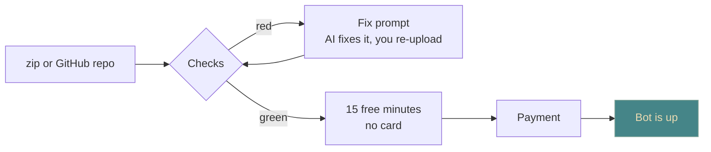

**Status: live.** [botxona.uz](https://botxona.uz), with the bot at
[@botxona_uz_bot](https://t.me/botxona_uz_bot). This note used to be a plan
called BotHost UZ. It's built, so the plan is gone — what's left is what the
thing does, and where I actually am with it.

## The gap it sits in

Writing a Telegram bot became a one-day job. **Keeping it running did not.** That
part still asks for a VPS, Linux, Docker and a foreign card. So people write the
bot, run it on their laptop, close the laptop — and the bot dies with it. Most of
them stop right there.

Botxona is only that last step. You drop in a zip or connect a GitHub repo, the
platform checks it, runs it in its own container, backs it up every night and
shows you what the bot is doing. Billing is in so'm, the panel is in Uzbek from
the first screen to the last.

One sentence: **send the bot, we keep it running.**

## Four steps

Everything before the payment is free, and the trial is deliberately a *running
bot* rather than a demo — you watch your own bot answer before you pay a so'm.
There's no free month: that's where abuse comes from. There is a **free tier**,
but only for bots from the
[ready-made catalogue](https://botxona.uz/tayyor-botlar) — the same offer, made
honest, for people who don't write code at all.

## What you get

- **Isolation** — one container per bot, its own network, and the filesystem
  read-only apart from `DATA_DIR`.
- **Sleep and wake** — idle bots are put to sleep when the box needs the memory
  and come back within seconds of the next message. "Always on" is a switch on
  the top tier.
- **Daily backups** at 03:00 Tashkent, kept 3 to 30 days depending on the plan,
  restored by picking a date.
- **Analytics without touching your code** — calls, errors, response times.
  Message text is never stored, and that's written into the terms.
- **GitHub auto-deploy** on push, on Pro and Business.

## Prices

| Plan | so'm/month | RAM / vCPU | Backups |
|---|---|---|---|
| **Bepul** | free, catalogue bots only | 256 MB / 0.1 | 3 days |
| **Start** | 29 000 | 256 MB / 0.25 | 7 days |
| **Pro** | 69 000 | 512 MB / 0.5 | 14 days |
| **Business** | 139 000 | 1 GB / 1 | 30 days |
| **Freelancer** | 119 000 | 5 × Start | 7 days |

A year costs ten months. The full table, with data limits and what each tier
unlocks, is on [the pricing page](https://botxona.uz/narxlar).

## The only thing your code has to agree to

Six rules, and nothing of mine gets added to your code: the token comes from
`BOT_TOKEN`, dependencies are pinned, the entry point is known, persistent files
live in `DATA_DIR`, settings are documented in `.env.example` — and Telegram
calls go through the platform proxy, which is what makes analytics work without a
single line from you. The checks run on upload; if they come back red you get a
**fix prompt** to hand to an AI instead of an error message to decode. There's a
[prompt library](https://botxona.uz/prompts) for the same reason — a prompt from
it produces code that passes on the first try.

## Where it is now

Built, deployed, and in the stage I like least and learn most from: **it's in
production and I'm testing it there.** The evenings go into reading logs and
fixing what they show, not into new features. Nothing on this page is a promise
about a future version — it's all live, which also means it's all exposed, so
the next few updates to this note will be about what broke.

If you have a bot sitting on your laptop, that's the one I want:
[botxona.uz](https://botxona.uz).

Related: [Ideas](/lab/ideas), [Telegram](/lab/skills/telegram),
[edge-stack](/lab/ideas/edge-stack), [shoshshi](/lab/ideas/shoshshi),
[Spec-first delivery](/lab/spec-first).
