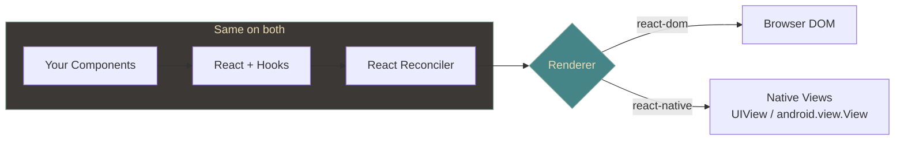
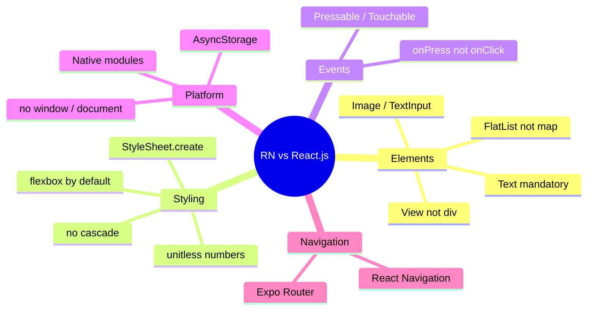
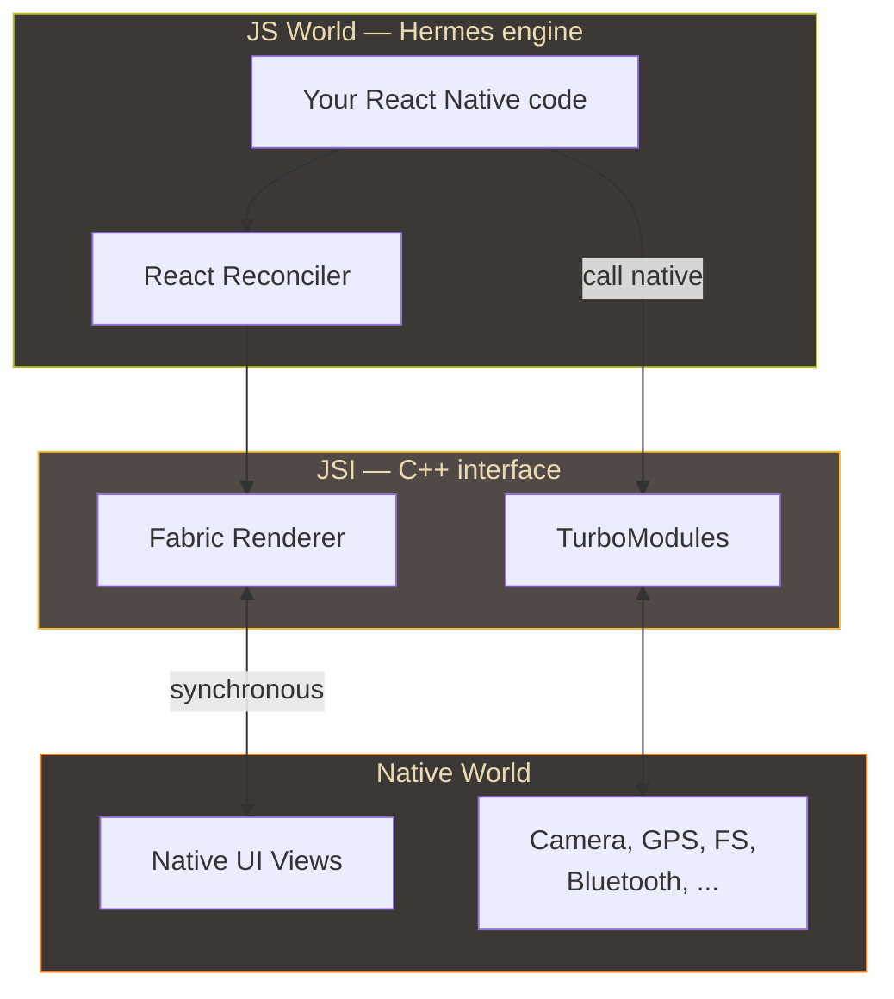
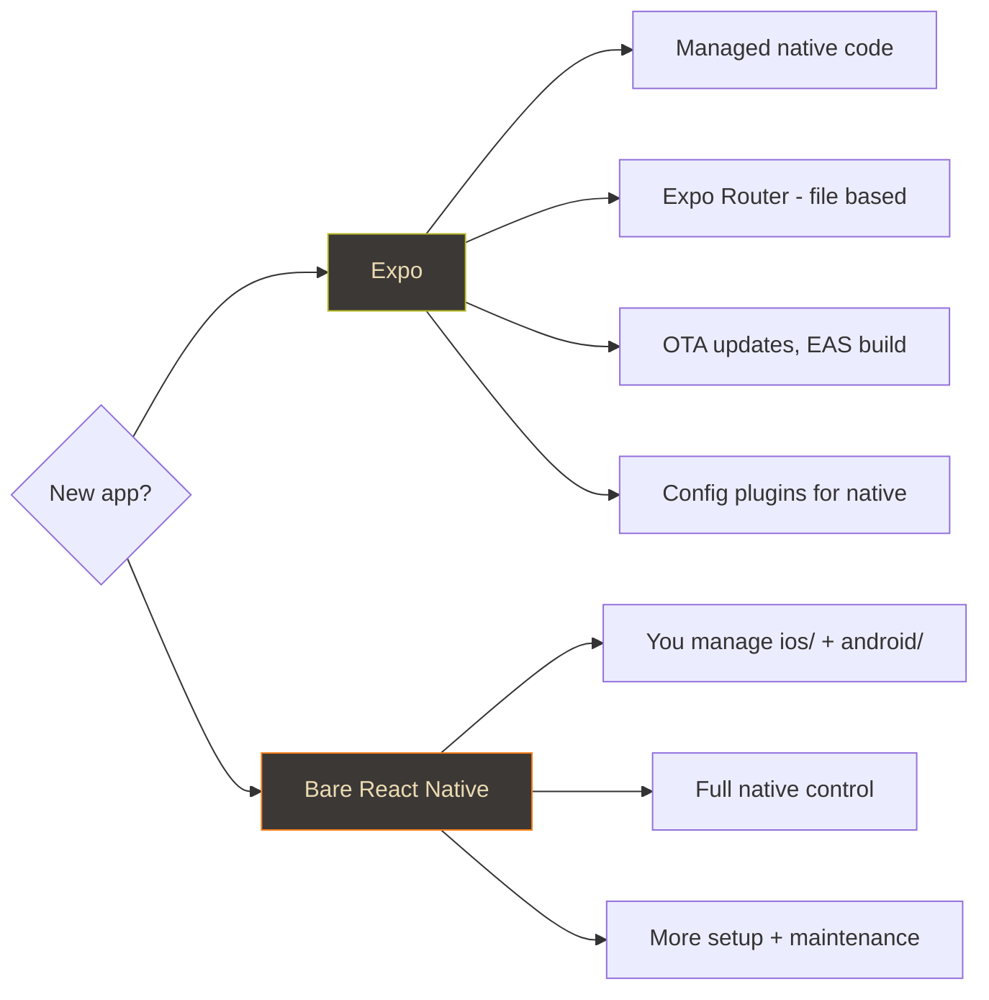
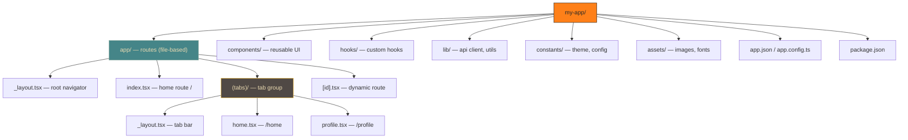

> **Learning log.** This is me thinking out loud while I pick up React Native. I already know React.js well, so I'm not re-learning components, props, state, hooks, or JSX — I'm learning what _changes_ when the render target stops being the DOM and becomes actual native UI. I'll keep editing this as I go. Where this note is a deep dive, [React Native](/lab/skills/react-native) is the short honest answer about how far I've taken it.

The single most useful mental model I've landed on: **React Native is React with a different renderer.** You keep the entire React programming model — the same `react` package, the same reconciler, the same hooks — but instead of `react-dom` painting to the browser DOM, `react-native` maps your component tree to real native views (`UIView` on iOS, `android.view.View` on Android).



So everything I already know about React is transferable. What I actually have to relearn is the **platform layer** underneath it.

---

## What stays exactly the same

Nothing to relearn here — just confirming the surface I keep:

- **Components, props, state** — identical.
- **Hooks** — `useState`, `useEffect`, `useRef`, `useMemo`, `useCallback`, `useContext`, custom hooks — all identical.
- **JSX** — identical syntax, different elements (see below).
- **The one-way data flow / composition model** — identical.
- **Context API** for cross-tree state — identical.
- **The npm ecosystem** — same `package.json`, same bundler mindset (Metro instead of Vite/Webpack).

---

## What changes — the concept map

This is the part I'm actually studying. Every web thing → its native equivalent.

| Web (React.js) | React Native | Note |
|---|---|---|
| `<div>`, `<span>` | `<View>` | The universal container. No `<div>`. |
| Text anywhere | `<Text>` | **All** text must be inside `<Text>`. You can't put a bare string in a `<View>`. |
| `` | `<Image>` | `source={{ uri }}` or `require()` for bundled assets. |
| `<input>` | `<TextInput>` | |
| `<button>` / `onClick` | `<Pressable>` / `onPress` | No `onClick` — it's `onPress` everywhere. |
| `<ul>` + `.map()` | `<FlatList>` / `<SectionList>` | Virtualized. Don't `.map()` long lists. |
| scrolling `<div>` | `<ScrollView>` | Explicit — the screen doesn't scroll by default. |
| CSS / classes | `StyleSheet.create({})` | JS objects, camelCase, subset of CSS. |
| `className` | `style={}` | No CSS cascade, no selectors. |
| `px`, `rem`, `%` | unitless numbers | Density-independent pixels. |
| `display: flex` (opt-in) | flexbox **by default** | Every `View` is a flex container, `flexDirection: 'column'` default. |
| `window`, `document` | ❌ gone | No DOM globals. Use RN/Expo APIs instead. |
| `localStorage` | `AsyncStorage` / MMKV | Async, not synchronous. |
| React Router | Expo Router / React Navigation | File-based or stack/tab navigators. |

The three that trip up web devs the most, in my experience so far:

1. **`<Text>` is mandatory for text.** A stray string in a `<View>` throws.
2. **`onPress`, not `onClick`.** Muscle memory fights you here.
3. **Styling is JS objects, flexbox-by-default, no cascade.** `StyleSheet.create` is basically inline styles with a perf optimization — there is no global stylesheet inheriting down the tree.



---

## The architecture — why it's not "just JS"

Here's the piece that has no web analogue. Your JS doesn't run in a DOM; it runs in a **separate JS engine** (Hermes) and talks to the native platform. Historically that was the async "bridge"; the New Architecture replaces it with **JSI** (a synchronous C++ interface), plus **Fabric** (the new renderer) and **TurboModules** (lazy native modules).



**Why I care as a web dev:** this is where "it's just React" leaks. Anything the phone can do that JS can't — camera, secure storage, background tasks, the filesystem — lives on the native side and is reached through a module. Most of the time a library (or Expo) has already written that native code for you. Occasionally you write it yourself in Swift/Kotlin (that's the "native module" rabbit hole).

---

## Expo vs bare React Native

The first real decision. **Expo** is a managed framework + toolchain on top of React Native — think Next.js is to React. Most people (me included) should start with Expo.



You can "eject" from managed to bare when you need custom native code, but with **config plugins** and **development builds** you rarely have to fully leave Expo anymore.

---

## Project structure of a real Expo app

This is the layout I'm converging on for an Expo Router project. Expo Router is file-based, so `app/` maps directly to routes — exactly the mental model I already have from Next.js.



Mapping it back to what I know:

- `app/_layout.tsx` ≈ Next.js root `layout.tsx` — defines the navigator (stack/tabs).
- `app/index.tsx` ≈ the `/` route.
- `app/(tabs)/` — a **route group**; parentheses mean "group without adding a URL segment," same as Next.js App Router.
- `app/[id].tsx` — dynamic route, same bracket convention as Next.js.
- `components/`, `hooks/`, `lib/` — nothing new; ordinary React project hygiene.

---

## A minimal first screen

To make the mapping concrete — the "hello world" that shows every difference at once:

```tsx
import { View, Text, Pressable, StyleSheet } from "react-native";
import { useState } from "react";

export default function Home() {
  const [count, setCount] = useState(0);

  return (
    <View style={styles.container}>
      <Text style={styles.title}>Taps: {count}</Text>
      <Pressable style={styles.btn} onPress={() => setCount((c) => c + 1)}>
        <Text style={styles.btnText}>Tap me</Text>
      </Pressable>
    </View>
  );
}

const styles = StyleSheet.create({
  container: { flex: 1, justifyContent: "center", alignItems: "center", gap: 16 },
  title: { fontSize: 24, fontWeight: "600" },
  btn: { backgroundColor: "#fe8019", paddingVertical: 12, paddingHorizontal: 24, borderRadius: 8 },
  btnText: { color: "#282828", fontWeight: "600" },
});
```

Everything React (`useState`, the arrow updater, JSX) is unchanged. Everything platform (`View`/`Text`/`Pressable`, `onPress`, `StyleSheet`, no `<div>`/`<button>`/`className`) is the new part. That single component _is_ the whole lesson.

---

## Running list of "gotchas" for a web brain

Things I keep tripping on — I'll append as I hit more:

- Text **must** be wrapped in `<Text>`. Always.
- There is no CSS cascade. Styles don't inherit (except a few text props within `<Text>`).
- Layout is flexbox by default and vertical (`flexDirection: 'column'`) — the opposite of web's default row-ish block flow.
- Percentages and `px` mostly don't apply; think in unitless density-independent numbers.
- `console.log` works, but debugging is via the dev menu / React Native DevTools, not the browser console.
- Fast Refresh ≈ HMR, but native module changes need a full rebuild.
- The screen doesn't scroll on its own — wrap in `<ScrollView>` or use a `<FlatList>`.
